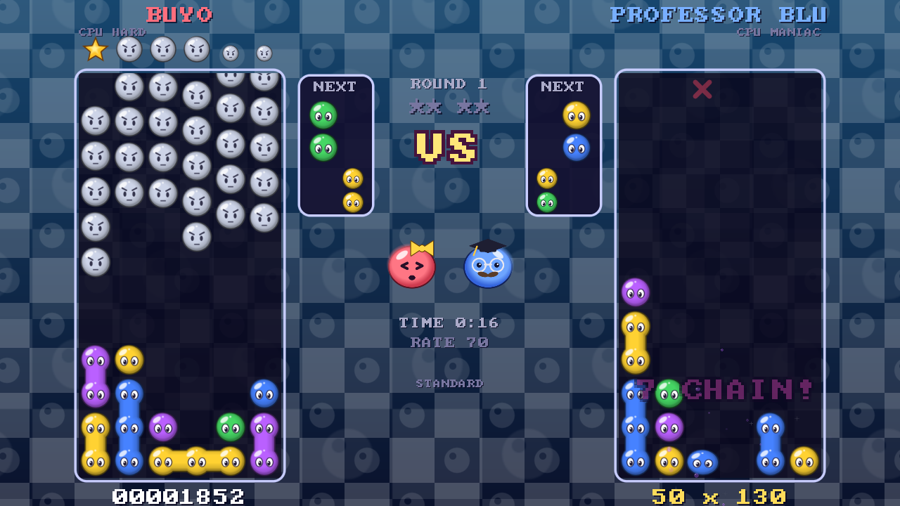
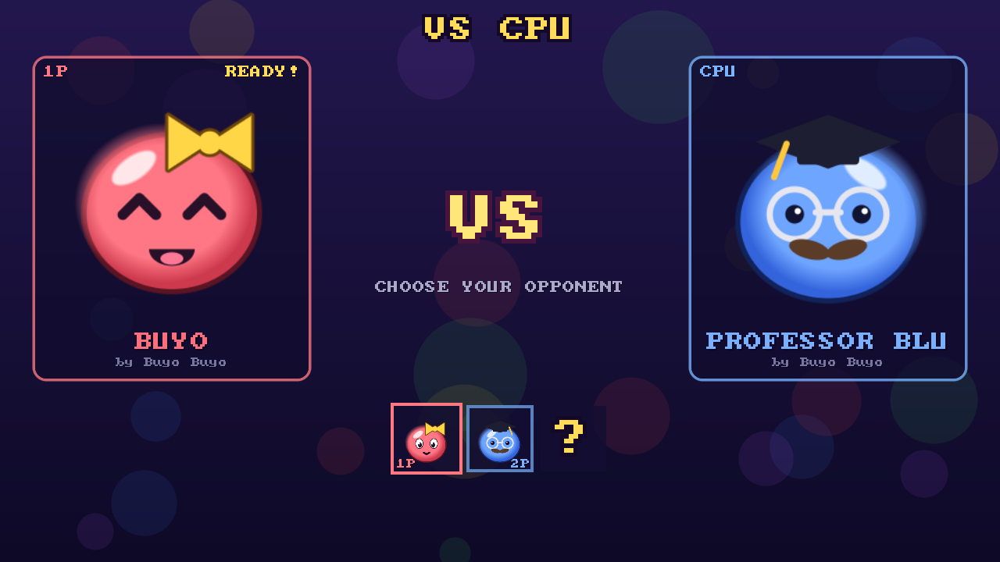
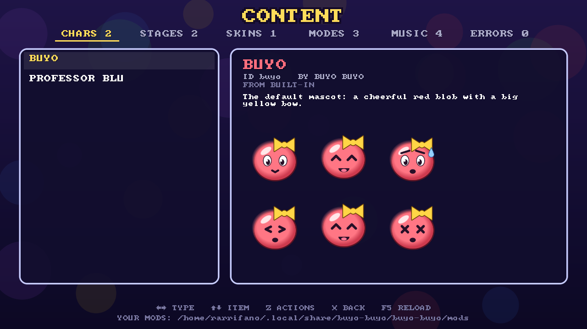

<div align="center">

# BUYO BUYO

**A moddable versus puzzle platform - the M.U.G.E.N of falling blobs.**

Pair-dropping, chain-building, nuisance-flinging 1v1 battles, with
rollback netplay and a content system anyone can make characters,
stages, skins, game modes and music for.




</div>

## Why it's fun

- **Real versus puzzle rules.** Pop 4 of a color, chain reactions,
  Tsu-style scoring, nuisance you can *offset* with your own chains,
  all-clear bonuses, margin time, wall/floor kicks and the quick turn.
- **A CPU that actually builds chains.** Four levels (EASY -> MANIAC); it
  simulates every placement, hunts for "virtual chains" and decides when to
  fire, counter or bury you. Characters give it a personality.
- **Online like a fighting game.** Rollback netcode, peer to peer, no
  servers or accounts: swap a 10-character code with a friend and play.
  UDP hole punching, input delay, desync detection - see
  [NETPLAY.md](docs/NETPLAY.md).
- **Local 2P**, CPU vs CPU, gamepads, fullscreen, hot reload.

## Make your own stuff

Everything you see and hear is **content**: a folder with your images and
sounds - **no programming needed** (`portrait.png` makes a character,
`background.png` a stage, `puyos.png` a skin, any `.ogg` a song, and a
plain-text `info.txt` sets names, colors and rules). Add a small Lua file
when you want more: painted-by-code art, animated stages, rule hooks. No
compiling, no engine changes - drop it in your mods folder and press **F5**.

| | | |
|---|---|---|
| **Characters** - portraits that react (idle, happy, worried, hurt, win, lose), voices per chain link, CPU personality | **Stages** - gradients, parallax PNG layers, or scripted animation | **Skins** - paint over an exported PNG sheet, or draw puyos with code |
| **Modes** - change any rule, or hook into chains, nuisance and win conditions | **Music** - OGG/WAV with loop points, or chiptunes written as text | **Content browser** - preview everything, "remix" any item into your mods, export skin templates |

Start with the **[Creator's Handbook](docs/README.md)**:
[Getting started](docs/GETTING_STARTED.md) ·
[Characters](docs/CHARACTERS.md) · [Stages](docs/STAGES.md) ·
[Skins](docs/SKINS.md) · [Modes](docs/MODES.md) · [Music](docs/MUSIC.md) ·
[API reference](docs/API.md)

Content runs sandboxed (it can draw and play sounds, not touch your files
or the network), broken content is reported instead of crashing, and
`--check-content` validates a pack before you share it.

<p align="center">
  
  
</p>

## Download

Grab a build for Windows, macOS or Linux from
[Releases](https://github.com/rarrifano/buyo-buyo/releases), unpack it and
run `buyo-buyo` (`buyo-buyo.exe` on Windows). The Windows zip has
everything it needs; on Linux install SDL2 (Fedora: `sdl2-compat`,
Debian/Ubuntu: `libsdl2-2.0-0`), on macOS `brew install sdl2`. Or build it
yourself, see below.

## Requirements

- A C compiler (`gcc`/`clang`), `make`, `pkg-config`
- SDL2 development files (Fedora: `sdl2-compat-devel`, Debian/Ubuntu:
  `libsdl2-dev`, macOS: `brew install sdl2 pkg-config`, MSYS2:
  `mingw-w64-x86_64-SDL2`)
- Lua 5.4 is vendored in `third_party/lua` by default (use `make LUA=system`
  to link against a system install instead), and so are the stb image/audio
  decoders - SDL2 is the only external dependency.

## Build & run

```
make            # build ./build/buyo-buyo
make run        # build and run
make test       # self-tests + scene smoke test + headless match + netplay loopback
```

Other useful targets:

```
make debug          # ASan/UBSan build in ./build-debug
make dist           # package binary + game + content + docs into ./dist
make windows        # cross-compile + package for Windows (needs mingw64)
```

No podman/host packages? `scripts/podman.sh` builds a container image with
everything installed (toolchain, SDL2, Lua, linters, mingw64):

```
scripts/podman.sh build     # compile inside the container
scripts/podman.sh test      # run the test suite inside the container
scripts/podman.sh windows   # cross-compile a ready-to-zip Windows build into dist/
scripts/podman.sh run       # play inside the container (Wayland/X11, audio, GPU, pads)
scripts/podman.sh shell     # interactive shell
```

A `.devcontainer/` config is also provided for VS Code / Dev Containers.

## Controls

| | Move | Soft drop | Hard drop | Rotate |
|---|---|---|---|---|
| VS CPU | `←` `→` or `A` `D` | `↓` or `S` | `↑` or `W` | `Z` `X` or `J` `K` |
| 2P - player 1 | `A` `D` | `S` | `W` | `F` `G` |
| 2P - player 2 | `←` `→` | `↓` | `↑` | `,` `.` |
| Gamepad | D-pad / stick | down | up | A/X left, B/Y right |

`Esc`/`Enter` pause · `F11` or `Alt+Enter` fullscreen · `F5` reload
scripts and content · `F12` screenshot. Hard drop can be turned off in
SETTINGS (Up then rotates).

## Command line

Extra arguments after `--` are forwarded to the game
(full list: [docs/CLI.md](docs/CLI.md)):

```
--mods DIR                 extra content folder (repeatable)
--mode cpu|2p|watch        start a match directly (skips menus)
--game-mode ID             content mode for --mode (default: tsu)
--char1 ID --char2 ID --stage ID --level N --level2 N --first-to N --seed N
--host | --connect CODE    online: wait for / connect to a friend
--net-port N --net-bot LEVEL --net-sim LAG,JITTER,LOSS --no-stun
--export-skin ID FILE      write a skin's sheet as PNG
--check-content            validate all content and quit (exit code 1 on errors)
--test                     run the self-tests and quit
```

## Layout

- `src/` - engine in C (SDL2 video/audio/input, canvas, UDP, filesystem,
  Lua bindings).
- `game/core/` - engine-agnostic helpers (scene, settings, sound, content
  loader, jukebox, util).
- `game/puyo/` - simulation: board, rules, match, ai, sequence. Kept
  deterministic (integer math only) so rollback netplay works.
- `game/net/` - rollback netplay (rollback engine, session, STUN, codes).
- `game/scenes/` - screens (title, select, versus, online, content, settings).
- `game/view/` - rendering (field, char, sprites, ui, fx, stage, skin).
- `game/tests/` - Lua self-tests (`--test`), run via `make test`.
- `content/` - built-in content, and the best examples to copy:
  `chars/<id>/char.lua`, `stages/<id>/stage.lua`, `skins/<id>/skin.lua`,
  `modes/<id>/mode.lua`, `music/<id>.lua`.
- `docs/` - the Creator's Handbook and technical notes.
- `third_party/` - vendored Lua 5.4.8 and stb (see its README).

## Contributing

See `AGENTS.md` for coding conventions, formatting (`make format`), and
linting (`make lint`). CI runs `make test` (Linux/macOS/Windows) and
lint/format checks on every push and pull request. New content goes in
`content/` (or a separate pack) - copy an existing folder's pattern rather
than editing the engine.

## License

GPL-2.0-or-later, see `LICENSE`. Vendored libraries keep their own
licenses (Lua: MIT, stb: public domain / MIT; see `third_party/`).
Content packs you make are yours: license them however you like.
